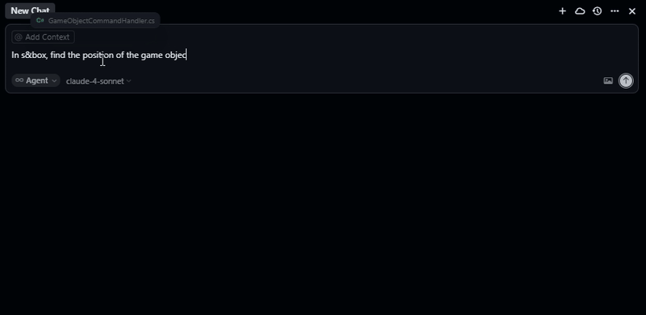

> [!IMPORTANT]
> ## Project Discontinued
>
> Development of this library has been discontinued.
>
> I decided to stop maintaining this project as the MCP ecosystem for **s&box** started moving forward in a different direction. Around the same time, **Braxen** began developing their own MCP, and multiple other MCPs started to be released.
>
> The main issue with this library is that it required building and running an external bridge server between the coding agent and the game engine. While this approach worked, it was not easy to set up, was painful to maintain, and added unnecessary complexity for users.
>
> In the end, I moved toward a different solution: **[sdocs.suiram.dev](https://sdocs.suiram.dev)**, an MCP focused on providing agents with better context about the s&box documentation and API.
>
> This turned out to be more useful than an MCP that directly bridges with the game engine. The bigger problem was not engine communication, but the lack of reliable documentation and API context available to coding agents.
>
> This repository will remain available for reference, but it should be considered deprecated and is no longer actively developed.

# Model Context Protocol for s&box

[](https://dotnet.microsoft.com/)
[](https://sbox.game/)

> [!IMPORTANT]
> This project is currently under active development.

A s&box library that enables AI assistants to interact with the s&box editor through the Model Context Protocol (MCP) via real-time WebSocket communication.

This adapter library works in conjunction with the separate [MCP Server](https://github.com/suiramdev/sbox-mcp-server) to provide seamless integration between AI assistants and your s&box projects.



## Prerequisites

- [s&box](https://sbox.game/) (latest version)
- [MCP Server](https://github.com/suiramdev/sbox-mcp-server) (must be installed and running separately)
- An MCP-compatible AI assistant (Claude Desktop, Cursor, etc.)

## Quick Start

### Step 1: Install and Run the MCP Server

Before using this adapter library, make sure the MCP Server is properly installed and running. This server acts as an API that enables your AI assistant to communicate with the library:

1. **Download and set up the MCP Server** by following the detailed installation and configuration steps in the [sbox-mcp-server repository](https://github.com/suiramdev/sbox-mcp-server).

### Step 2: Install the Adapter Library in s&box

1. **Install this library** in your s&box project through the **Asset Library**. [Find it on asset.party](https://sbox.game/sdv/modelcontextprotocol)

Once the MCP Server is running:

2. **Navigate to MCP → Connect to MCP Server** in the s&box editor menu bar.

3. **Listen for the connection confirmation**: You'll hear a success sound and see a success message in the console when connected.

> [!IMPORTANT]
> The MCP Server must be running for this adapter library to function. Please refer to the [MCP Server documentation](https://github.com/suiramdev/sbox-mcp-server) for detailed installation and configuration instructions.


## Usage

Once both the MCP Server and this adapter library are installed and connected, you can interact with your s&box project using natural language through your AI assistant:

```
"Create a ModelRenderer component on the Cube object"
"Find all game objects named 'Player'"
"Set the Scale property of the Transform component on MainCamera to 2,2,2"
"Remove the Rigidbody component from the Ball object"
"Show me all components attached to the Ground object"
```

## Architecture

This adapter library acts as a bridge between:
- **s&box Editor** ↔ **This Adapter Library** ↔ **MCP Server** ↔ **AI Assistant**

The adapter library:
- Connects to the external MCP Server via WebSocket
- Translates MCP commands into s&box editor operations
- Provides real-time feedback to AI assistants

## Contributing

Contributions are welcome! Please feel free to submit a Pull Request. For major changes, please open an issue first to discuss what you would like to change.

### Related Repositories

- **MCP Server**: [sbox-mcp-server](https://github.com/suiramdev/sbox-mcp-server) - The main server component
- **This Library**: Adapter library for s&box integration

## Support

- **Issues**: [GitHub Issues](https://github.com/suiramdev/sbox-mcp-library/issues)
- **Discussions**: [GitHub Discussions](https://github.com/suiramdev/sbox-mcp-library/discussions)
- **MCP Server Support**: [MCP Server Issues](https://github.com/suiramdev/sbox-mcp-server/issues)
